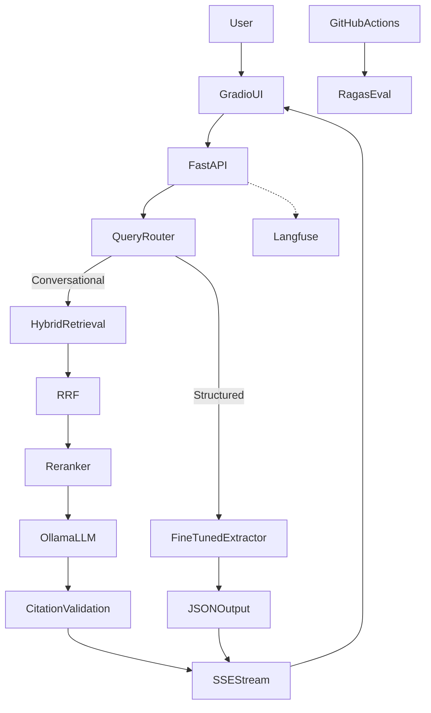

# PaperLens — End-to-End Project Blueprint

**PaperLens** is a production-grade research intelligence platform that ingests ML/AI papers from arXiv, enables cited cross-paper querying, extracts structured paper intelligence via a fine-tuned model, and streams responses in real time. Built entirely on open-source tooling with no paid API dependencies — with a **tiered deployment strategy**: $0 primary demo, HF Spaces fallback, and optional AWS/GCP fallback for cloud platform exposure.

**Interview story:** *"I built a research intelligence system that a team of ML engineers could actually deploy to query hundreds of papers — not just a chatbot wrapper, but a full stack with hybrid retrieval, a fine-tuned extractor, observability, and CI evaluation gating."*

Reference diagrams: [`plan/paperlens_architecture.xml`](paperlens_architecture.xml) · [`plan/paperlens_flowchart.xml`](paperlens_flowchart.xml)

---

## System Architecture

---

## Tech Stack

| Layer | Tool |
|---|---|
| Data source | arXiv Python API |
| PDF parsing | PyMuPDF |
| Embeddings | `BAAI/bge-large-en-v1.5` (sentence-transformers) |
| Vector store | ChromaDB |
| Keyword search | `rank_bm25` |
| Reranker | `cross-encoder/ms-marco-MiniLM-L-12-v2` |
| LLM inference | Ollama (`llama3.2:3b` or `phi4-mini`) |
| Fine-tuning | HuggingFace TRL + PEFT (QLoRA), base `Qwen2.5-3B-Instruct` |
| Fine-tuning data | `allenai/qasper` + synthetic examples via Ollama |
| Evaluation | Ragas |
| Observability | Langfuse (self-hosted via Docker) |
| API | FastAPI with SSE streaming |
| UI | Gradio |
| CI | GitHub Actions |
| Containerization | Docker + docker-compose |
| Deployment (free tier) | Oracle Cloud Always Free VM, Cloudflare Tunnel, Hugging Face Spaces (demo fallback) |
| Deployment (cloud fallback) | AWS (EC2 / ECS) or GCP (GCE / Cloud Run) — optional, cost-controlled |

---

## Documentation Convention

Every milestone ends with a **Docs** step. Treat documentation as a deliverable, not an afterthought — it is what interviewers read first. Update the relevant `docs/` file before marking a milestone complete.

---

## Phase 0: Project Foundation

**Goal:** Establish repo, tooling, and conventions before any ML code.

### Milestone 0.1 — GitHub Repository Setup

- [X] Create GitHub repo `paperlens` (public, MIT license)
- [X] Add `.gitignore` (Python, ChromaDB, `.env`, model caches, `__pycache__`)
- [X] Add `README.md` stub with project name, one-line pitch, and "under construction" badge
- [X] Enable GitHub Issues and Projects board for milestone tracking
- [X] Add `CONTRIBUTING.md` with branch naming (`feature/`, `fix/`) and PR expectations
- [X] **Docs:** Record repo URL, license choice, and branch strategy in `docs/project-setup.md`

### Milestone 0.2 — Local Development Environment

- [X] Install Python 3.11+, create virtual environment
- [X] Install Ollama; pull `llama3.2:3b` (or `phi4-mini`) and verify inference
- [X] Install Docker and Docker Compose
- [X] Verify GPU/CPU constraints on target machine (Dell Latitude 7490)
- [X] Create `.env.example` with all config placeholders (no secrets)
- [X] **Docs:** Write `docs/dev-environment.md` — prerequisites, install commands, verification checklist

### Milestone 0.3 — Project Scaffolding

- [X] Define directory layout: `src/`, `configs/`, `data/`, `scripts/`, `tests/`, `docs/`, `eval/`
- [X] Add `pyproject.toml` or `requirements.txt` with pinned core deps
- [X] Add `Makefile` or `scripts/run.sh` for common commands
- [X] Set up pre-commit hooks (ruff/black/isort or equivalent)
- [X] Add initial CI workflow: lint + unit test skeleton on push
- [X] **Docs:** Write `docs/architecture-overview.md` linking to existing XML diagrams in `plan/`

---

## Phase 1: Core RAG Pipeline

**Goal:** End-to-end RAG over 200–500 arXiv papers with cited answers.

**Deliverable:** Query 500 arXiv papers and get an answer with a source paper cited.

### Milestone 1.1 — arXiv Data Ingestion

- [X] Choose ML subfield domain (transformers / diffusion / RL — pick one)
- [X] Implement arXiv fetch script using arXiv Python API (200–500 papers)
- [X] Download PDFs; store metadata (title, authors, arXiv ID, date, abstract)
- [X] Add idempotent re-run logic and ingestion logging
- [X] **Docs:** Document domain choice rationale and dataset stats in `docs/data-ingestion.md`

### Milestone 1.2 — Document Parsing & Section-Aware Chunking

- [ ] Implement PDF parsing with PyMuPDF
- [ ] Detect section boundaries (Abstract, Introduction, Method, Results, etc.)
- [ ] Chunk at 600 tokens with 100-token overlap; preserve section metadata per chunk
- [ ] Assign unique chunk IDs linked to paper metadata
- [ ] Persist processed chunks to disk (JSON/Parquet)
- [ ] **Docs:** Document chunking strategy and sample chunk schema in `docs/chunking.md`

### Milestone 1.3 — Embeddings & Vector Store

- [ ] Integrate `BAAI/bge-large-en-v1.5` via sentence-transformers
- [ ] Batch-embed all chunks; store in ChromaDB with metadata
- [ ] Implement basic semantic search (top-k retrieval)
- [ ] Add index rebuild script for reproducibility
- [ ] **Docs:** Record embedding model choice, index size, and retrieval latency baseline in `docs/retrieval-baseline.md`

### Milestone 1.4 — FastAPI Backend (Basic RAG)

- [ ] Create FastAPI app with health check and `/query` endpoint
- [ ] Wire retrieval → context assembly → Ollama LLM generation
- [ ] Return answer with source paper/chunk references
- [ ] Add request/response Pydantic schemas
- [ ] **Docs:** Write `docs/api.md` with endpoint specs and example curl requests

### Milestone 1.5 — Gradio UI & Inference Benchmarks

- [ ] Build Gradio query interface connected to FastAPI
- [ ] Display answer and source citations in UI
- [ ] Benchmark Ollama: tokens/sec, time-to-first-token, memory usage
- [ ] Tag git release `v0.1.0-core-pipeline`
- [ ] **Docs:** Update `README.md` with Phase 1 demo GIF/screenshot and inference benchmark table

---

## Phase 2: Production-Grade Retrieval & Grounded Outputs

**Goal:** Hybrid retrieval + reranking + citation enforcement with measurable quality gains.

**Deliverable:** Retrieval pipeline with precision@5 metrics showing hybrid + reranker outperforms basic vector search.

### Milestone 2.1 — BM25 Keyword Index

- [ ] Build BM25 index over chunk corpus using `rank_bm25`
- [ ] Persist index alongside ChromaDB collection
- [ ] Expose BM25 top-k retrieval independently for debugging
- [ ] **Docs:** Add BM25 index stats and rebuild instructions to `docs/retrieval-baseline.md`

### Milestone 2.2 — Hybrid Retrieval with Reciprocal Rank Fusion

- [ ] Run semantic + BM25 retrieval in parallel per query
- [ ] Merge candidate lists with Reciprocal Rank Fusion (RRF)
- [ ] Tune candidate pool size (e.g., top 20 before reranking)
- [ ] **Docs:** Document RRF formula, parameters, and design trade-offs in `docs/hybrid-retrieval.md`

### Milestone 2.3 — Cross-Encoder Reranking

- [ ] Integrate `cross-encoder/ms-marco-MiniLM-L-12-v2`
- [ ] Rerank RRF candidates; pass top 5 to LLM
- [ ] Log reranker scores per chunk for later observability
- [ ] **Docs:** Explain retriever-vs-reranker cost/quality trade-off in `docs/hybrid-retrieval.md`

### Milestone 2.4 — Citation Enforcement & Structured Responses

- [ ] Externalize prompts to versioned YAML in `configs/prompts/`
- [ ] Enforce grounded-answer prompt (refuse if evidence missing)
- [ ] Validate LLM output with Pydantic: `{answer, citations, confidence}`
- [ ] Add retry logic for malformed LLM outputs
- [ ] **Docs:** Document response schema and refusal behavior in `docs/citation-enforcement.md`

### Milestone 2.5 — Retrieval Quality Benchmark

- [ ] Curate small test set (~20–30 queries with known relevant chunks)
- [ ] Measure precision@5: baseline vs hybrid vs hybrid+reranker
- [ ] Record results in a comparison table
- [ ] Tag git release `v0.2.0-retrieval`
- [ ] **Docs:** Publish benchmark table and analysis in `docs/evaluation/retrieval-metrics.md`; update README results section

---

## Phase 3: Fine-Tuned Structured Extraction Module

**Goal:** LoRA-fine-tuned model for structured paper intelligence, routed from main API.

**Deliverable:** Fine-tuned model on HuggingFace Hub, extraction benchmark results, routing logic integrated into the main API.

### Milestone 3.1 — Training Data Preparation

- [ ] Load `allenai/qasper` from HuggingFace Datasets
- [ ] Define extraction JSON schema (research question, method, datasets, metrics, baselines)
- [ ] Generate 2,000–4,000 synthetic examples from arXiv abstracts via Ollama
- [ ] Format as instruction-following examples; split train/val/test
- [ ] **Docs:** Document schema, data sources, and split sizes in `docs/finetuning/data-prep.md`

### Milestone 3.2 — QLoRA Fine-Tuning

- [ ] Set up Colab notebook or local training script with TRL + PEFT
- [ ] Fine-tune `Qwen2.5-3B-Instruct` with 4-bit QLoRA
- [ ] Track training loss; save checkpoints
- [ ] Push LoRA adapter to HuggingFace Hub
- [ ] **Docs:** Record hyperparameters, training time, and loss curves in `docs/finetuning/training-run.md`

### Milestone 3.3 — Extraction Evaluation

- [ ] Measure JSON validity rate (base model vs fine-tuned)
- [ ] Compute field-level F1 on held-out test set
- [ ] Document before/after comparison with concrete examples
- [ ] **Docs:** Publish extraction benchmark in `docs/evaluation/extraction-metrics.md`

### Milestone 3.4 — Query Router & API Integration

- [ ] Implement query classifier/router (conversational vs structured extraction)
- [ ] Add `/extract` endpoint or route within `/query`
- [ ] Load fine-tuned adapter at inference time
- [ ] End-to-end test: structured queries return valid JSON
- [ ] Tag git release `v0.3.0-extraction`
- [ ] **Docs:** Update `docs/architecture-overview.md` with routing logic; add router decision examples to `docs/api.md`

---

## Phase 4: Observability, Streaming & CI Evaluation

**Goal:** Production-readiness — traceable, streamable, continuously evaluated.

**Deliverable:** Fully instrumented pipeline, streaming UI, evaluation CI in GitHub Actions, README with plots showing metric evolution.

### Milestone 4.1 — Langfuse Observability

- [ ] Add Langfuse to `docker-compose.yml`; verify local UI
- [ ] Instrument pipeline steps: retrieval, reranker scores, prompt version, tokens, latency
- [ ] Track P50/P95 latency per component and end-to-end
- [ ] Build Langfuse dashboard views for confidence and citation coverage
- [ ] **Docs:** Write `docs/observability.md` — trace anatomy, debugging workflow, sample trace screenshots

### Milestone 4.2 — SSE Streaming

- [ ] Replace blocking `/query` with FastAPI `StreamingResponse` (SSE)
- [ ] Stream Ollama tokens via SSE; measure time-to-first-token separately
- [ ] Update Gradio frontend to consume SSE and render tokens live
- [ ] Ensure structured extraction path also streams appropriately
- [ ] **Docs:** Document streaming protocol and latency breakdown in `docs/streaming.md`

### Milestone 4.3 — Gold Evaluation Dataset

- [ ] Manually curate 75 QA pairs from real papers (question, expected answer, source chunk)
- [ ] Store in `eval/gold_dataset.jsonl` with versioning
- [ ] Implement Ragas evaluation script (faithfulness, answer relevancy, context precision)
- [ ] Establish baseline scores for current pipeline
- [ ] **Docs:** Document gold dataset creation process and annotation guidelines in `docs/evaluation/gold-dataset.md`

### Milestone 4.4 — GitHub Actions Evaluation Gating

- [ ] Add CI workflow running Ragas on gold dataset for every PR
- [ ] Fail build if faithfulness drops below 0.75 threshold
- [ ] Cache models/embeddings in CI where possible
- [ ] Add evaluation score badge to README
- [ ] Tag git release `v0.4.0-production`
- [ ] **Docs:** Document CI pipeline, thresholds, and how to run eval locally in `docs/evaluation/ci-gating.md`

### Milestone 4.5 — Dockerized Full Stack

- [ ] Create `Dockerfile` for FastAPI + Gradio services
- [ ] Extend `docker-compose.yml`: app + Langfuse + ChromaDB volumes
- [ ] Verify one-command startup: `docker-compose up`
- [ ] **Docs:** Write `docs/deployment/local-docker.md` with setup and troubleshooting

---

## Phase 5: Portfolio, Documentation & Interview Readiness

**Goal:** Transform the working system into a compelling interview portfolio asset.

**Deliverable:** Results-first README, complete docs index, interview story kit, v1.0.0 release.

### Milestone 5.1 — Results-First README

- [ ] Restructure README: architecture diagram → evaluation numbers → fine-tuning results → setup
- [ ] Add retrieval before/after table, extraction before/after table, CI faithfulness score
- [ ] Add architecture diagram (export from `plan/paperlens_architecture.xml`)
- [ ] Add demo video or GIF of streaming query with citations
- [ ] **Docs:** README is the primary portfolio artifact — peer-review for clarity

### Milestone 5.2 — Technical Deep-Dive Docs

- [ ] Write `docs/design-decisions.md` — why hybrid retrieval, why fine-tuning, why local SLMs
- [ ] Write `docs/limitations-and-future-work.md` — honest scope boundaries (include multi-node K8s as future work; note AWS/GCP fallback is single-instance by design)
- [ ] Consolidate all `docs/` into a navigable index (`docs/README.md`)
- [ ] **Docs:** Each doc should answer one interview question explicitly

### Milestone 5.3 — Interview Story Kit

- [ ] Prepare 2-minute elevator pitch (problem → approach → results)
- [ ] Prepare 5-minute architecture walkthrough script
- [ ] List 10 likely interview questions with prepared answers referencing concrete metrics
- [ ] Add resume/LinkedIn bullet point: *"Built a production RAG system over ML research papers with hybrid retrieval (BM25 + semantic + cross-encoder reranking), a QLoRA fine-tuned structured extractor, Langfuse observability, and Ragas CI evaluation gating — fully on open-source tooling."*
- [ ] **Docs:** Store in `docs/interview/` — `pitch.md`, `architecture-talk-track.md`, `qa-prep.md`

### Milestone 5.4 — Feature-Complete Release

- [ ] Tag git release `v1.0.0`
- [ ] Verify all docs links work; no broken references
- [ ] Archive phase-by-phase metric evolution plots in `docs/evaluation/metric-evolution.md`
- [ ] **Docs:** Write `docs/project-retrospective.md` — what worked, what you'd do differently (update again after Phase 6)

---

## Phase 6: Public Deployment (Zero-Cost Primary, Cloud Fallbacks)

**Goal:** Deploy a publicly accessible demo with a **tiered deployment strategy** — primary path at **$0/month**, optional fallbacks for portability and AWS/GCP interview exposure.

**Deployment tiers (in priority order):**

| Tier | Path | Cost | Purpose |
|---|---|---|---|
| **Primary** | Oracle Cloud Always Free VM or Cloudflare Tunnel | $0/month | Default live demo URL in README |
| **Fallback A** | Hugging Face Spaces (slim demo) | $0/month | Always-on lightweight demo if primary is down |
| **Fallback B** | AWS (EC2/ECS) or GCP (GCE/Cloud Run) | Free tier / pay-per-use with hard caps | Cloud platform exposure for interviews; tear down when not demoing |

**Constraint:** Free tiers have RAM/CPU limits. The full stack needs ~8–16 GB RAM. Define a "demo mode" config (smaller LLM, reduced corpus) for constrained environments.

**Deliverable:** Live public URL (primary), documented fallback paths, deploy runbooks for each tier, and cost-control checklist — all documented.

### Milestone 6.1 — Deployment Strategy & Resource Budget

- [ ] Inventory RAM/CPU/disk requirements per service (Ollama, embeddings, reranker, ChromaDB, Langfuse)
- [ ] Evaluate **primary** ($0): Oracle Cloud Always Free ARM VM (~24 GB RAM), Cloudflare Tunnel to home machine
- [ ] Evaluate **Fallback A** ($0): Hugging Face Spaces free CPU tier
- [ ] Evaluate **Fallback B** (cost-controlled): AWS EC2 (`t3.large` / free tier) or ECS Fargate; GCP GCE (`e2-standard-4`) or Cloud Run — document monthly cost estimates and free-tier eligibility
- [ ] Choose primary target; document when to use each fallback
- [ ] Define "demo mode" config if RAM requires a smaller LLM (e.g. `llama3.2:1b`) or reduced paper corpus
- [ ] **Docs:** Write `docs/deployment/deployment-strategy.md` — tier comparison table, chosen paths, resource budget, cost caps, trade-offs

### Milestone 6.2 — Production Config & Secrets

- [ ] Split configs: `configs/dev.yaml` vs `configs/production.yaml` (model names, corpus size, timeouts)
- [ ] Add production `.env.example`; store real secrets only on the server or in GitHub Secrets (never in repo)
- [ ] Add `/health` and `/ready` endpoints for deploy verification
- [ ] Configure Docker restart policies (`unless-stopped`) for all services
- [ ] **Docs:** Write `docs/deployment/environment-config.md` — every env var, prod vs dev differences, secret handling

### Milestone 6.3 — Pre-Built Artifacts for Fast Cold Start

- [ ] Script to export pre-built ChromaDB index and BM25 index as deployable artifacts
- [ ] Store artifacts in GitHub Releases, HuggingFace Hub dataset, or on-server persistent volume (avoid rebuilding on every deploy)
- [ ] Document artifact size and download time on free-tier bandwidth
- [ ] Verify index loads correctly on a clean machine without re-ingesting papers
- [ ] **Docs:** Write `docs/deployment/artifact-pipeline.md` — build, upload, and restore steps

### Milestone 6.4 — Deploy Full Stack (Primary Path)

**Option A — Oracle Cloud Always Free VM (recommended for 24/7 public demo):**

- [ ] Provision Always Free ARM VM (Ubuntu); configure firewall (allow 80/443 only)
- [ ] Install Docker + Docker Compose; clone repo; restore index artifacts
- [ ] Run `docker-compose up -d`; verify all services healthy
- [ ] Expose via Cloudflare Tunnel (free HTTPS, no domain purchase) or Oracle public IP

**Option B — Cloudflare Tunnel to home machine (recommended if VM signup is unavailable):**

- [ ] Install `cloudflared`; create free Cloudflare Tunnel to local `docker-compose` stack
- [ ] Document machine must be on for demo availability; set expectations in README

- [ ] Run end-to-end smoke test via public URL (query → streamed answer → citations)
- [ ] **Docs:** Write `docs/deployment/production-runbook.md` — step-by-step deploy for primary path, rollback, and common failures

### Milestone 6.5 — Deploy Automation

- [ ] Add `scripts/deploy.sh` (or GitHub Actions deploy workflow triggered on release tag)
- [ ] Automate: pull latest image/code → restore artifacts → restart services → run smoke test
- [ ] Store deploy credentials in GitHub Secrets (SSH key or Cloudflare token)
- [ ] **Docs:** Write `docs/deployment/ci-cd-deploy.md` — trigger conditions, manual override, rollback procedure

### Milestone 6.6 — Fallback A: Hugging Face Spaces (Lightweight Demo)

- [ ] Create HF Space with Gradio UI connected to a slimmed-down backend (smaller model, ~50-paper subset, pre-built index)
- [ ] Pin dependencies in `requirements.txt` for reproducible Space builds
- [ ] Add "Live Demo (Fallback)" badge/link in README
- [ ] **Docs:** Write `docs/deployment/hf-spaces-demo.md` — Space setup, limitations vs full deployment, rebuild steps

### Milestone 6.7 — Fallback B: AWS / GCP Cloud Deployment (Optional)

**Goal:** Gain hands-on AWS/GCP exposure for interviews. Only deploy when needed for demos; tear down afterward to avoid ongoing cost.

**AWS path (pick one):**

- [ ] Set billing alert ($5–10 hard cap) and AWS Budget in account before any deploy
- [ ] **Option AWS-A — EC2:** Launch Ubuntu EC2 instance (free tier or `t3.large`); install Docker Compose; deploy stack using same artifacts as primary path
- [ ] **Option AWS-B — ECS:** Containerize services; define ECS task definitions + Fargate service (document architecture even if EC2 is simpler to start)
- [ ] Configure security group (443/80 only); store secrets in AWS Secrets Manager or SSM Parameter Store
- [ ] Run smoke test; record deploy/teardown commands

**GCP path (pick one):**

- [ ] Set billing alert and budget in GCP project before any deploy
- [ ] **Option GCP-A — GCE:** Launch Ubuntu VM (`e2-standard-4` or free-tier eligible); Docker Compose deploy
- [ ] **Option GCP-B — Cloud Run:** Deploy FastAPI as Cloud Run service; document how Ollama/embedding workloads are handled (sidecar VM or demo-mode API-only)
- [ ] Configure firewall rules; store secrets in GCP Secret Manager
- [ ] Run smoke test; record deploy/teardown commands

- [ ] Document which cloud path you implemented and why (1-page decision record)
- [ ] Add "Cloud Fallback" section to README with architecture diagram (VPC, security groups, artifact storage e.g. S3/GCS)
- [ ] **Docs:** Write `docs/deployment/aws-gcp-fallback.md` — IaC or step-by-step runbook, cost estimate, teardown procedure, interview talking points (ECS vs EC2, Cloud Run vs GCE, secret management, artifact pipeline on S3/GCS)

### Milestone 6.8 — Post-Deploy Operations & README Update

- [ ] Set up free uptime monitoring on **primary** URL (e.g. UptimeRobot or GitHub Actions scheduled health check)
- [ ] Measure and document latency: local vs primary vs cloud fallback (P50/P95, cold start)
- [ ] Add live demo URL(s), tier explanation, uptime caveats, and deployment architecture diagram to README
- [ ] Verify billing is $0 on primary; confirm cloud fallback resources are **stopped/deleted** after validation
- [ ] Tag git release `v1.1.0-deployed`
- [ ] Close GitHub Project board milestones; mark all phases complete
- [ ] **Docs:** Write `docs/deployment/operations.md` — monitoring, per-tier cost checklist, incident response; update `docs/project-retrospective.md` with deployment lessons

---

## Phase Deliverable Summary

| Phase | Release Tag | Key Deliverable |
|---|---|---|
| 0 — Project Foundation | — | Repo, dev environment, project scaffolding, CI skeleton |
| 1 — Core RAG Pipeline | `v0.1.0-core-pipeline` | Query 500 papers with cited answers via Gradio + FastAPI |
| 2 — Production Retrieval | `v0.2.0-retrieval` | Hybrid retrieval + reranker + citation enforcement with precision@5 benchmarks |
| 3 — Fine-Tuned Extraction | `v0.3.0-extraction` | QLoRA model on HuggingFace Hub, extraction benchmarks, query router |
| 4 — Observability & CI | `v0.4.0-production` | Langfuse tracing, SSE streaming, Ragas CI gating, docker-compose full stack |
| 5 — Portfolio & Interview | `v1.0.0` | Results-first README, interview kit, complete docs, project retrospective |
| 6 — Public Deployment | `v1.1.0-deployed` | Primary $0 demo URL, HF Spaces fallback, optional AWS/GCP fallback with docs and cost controls |

---

## Excluded Scope

The following are deliberately out of scope to keep the project focused and demo-reliable:

- **Voice interface** (Whisper + TTS) — streaming SSE already demonstrates real-time engineering competency
- **Production multi-node orchestration** (managed Kubernetes, load-balanced multi-region clusters, auto-scaling beyond single-instance) — Phase 6 Fallback B covers single-instance AWS/GCP exposure; multi-node scaling stays in `docs/limitations-and-future-work.md` as a discussion topic

Concepts from excluded items transfer directly in interviews without adding unnecessary operational complexity.
